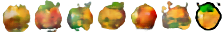
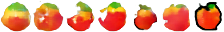

# text2emoji

Using a neural net to generate emojis from words. The network takes word embeddings as inputs, and produces pixels as outputs. Using a trained model, you can create a new phrase like "red banana" and see what the emoji would look like.

Since there aren't that many emojis (on the order of a few thousand), there is likely not enough data to train anything useful. Still, though, it's possible to generate hilarious images.

# Results

Here is a table of some cherry-picked generalizations. Keep in mind that the [emoji dataset](https://unicode.org/emoji/charts/full-emoji-list.html) is very specific; there is no "apple" emoji, for example, just "red apple" and "green apple".

| Image | Phrase |
|-------|--------|
|  | apple |
|  | yellow apple |
|  | red banana |
|  | rainbow_cross_mark |
|  | clown face with horns |
|  | flower |
|  | rainbow duck |
|  | rainbow bomb |
|  | rainbow smiling face with horns |

Here are some reconstructions from the training set:

# Usage

 * Download [glove embeddings](http://nlp.stanford.edu/data/glove.42B.300d.zip) and unzip them into this directory.
 * Run `python fetch.py` to download the emoji data.
 * Run `python run_train.py` to train a model.
 * Run `python run_grid.py` to produce reconstructions from the training set.
 * RUn `python run_eval.py` to produce images for new phrases.
